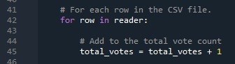
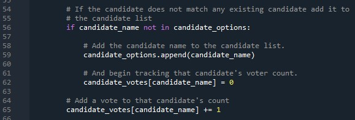
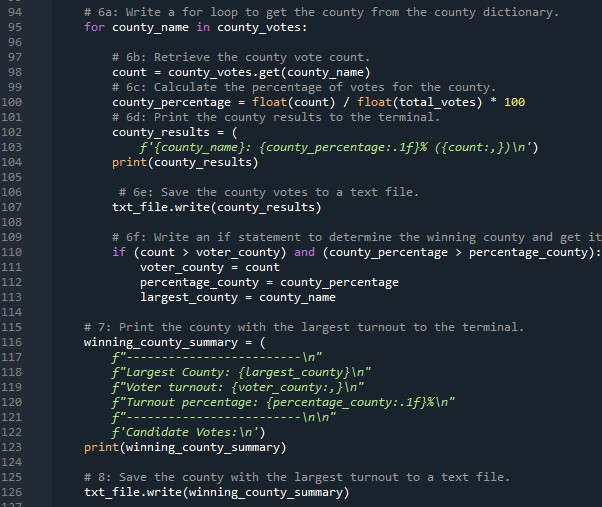
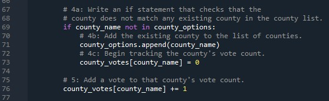
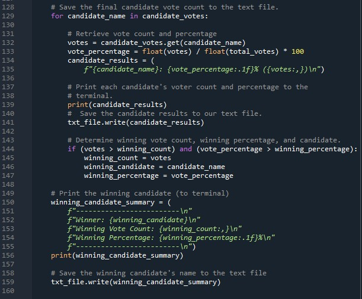
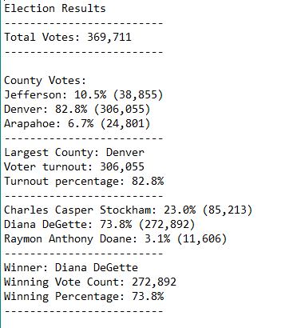

# election_analysis

## Overview 
The following tasks were given to complete the election audit of a local election
- Calculate the total votes cast
- Get a complete list of candidates
- Calculate the total votes for each candidate
- Calculate the percentages of votes each candidate recieved
- Get a complete list of counties that had ballots
- Calculate the voter turnout for each county (number of votes per county)
- Determing the county with the highest turnout
- Determine the winner of the election

## Purpose

Perform analysis on the election audit results. Specifically, use Python to analyze the large data set and determine the winner of the election and the county that has the highest voter turnout. Additionally, the use of python will help to further obtain specific data in regards to the candidates and counties in the election audit.

## Election-Audit Results:

### Total Votes Cast

- A for loop was used to determine the total votes in the election data set. Every row was counted as one vote. There was a total of 369,711 votes in the election audit.

### County Analysis

- In the python script, inside the for loop from row 42, an if statement was used to determine the specific counties that had votes cast as well as how many votes per county. 
  - Jefferson: 38,855 votes
  - Denver: 306,055 votes
  - Arapahoe: 24,801 votes

- Lines 97 - 104 calculated the percentage of votes each county received out of the total 369,711 votes.
  - Jefferson: 10.5% percent of the total votes
  - Denver: 82.8% of the total votes
  - Arapahoe: 6.7% of the total votes

- Lines 110 – 123 determined which county had the highest percentage  
  - The county with the highest voter turnout was Denver: 82.8% (306,055)

### Candidate Analysis

- Lines 56 – 65, inside the for loop (line 42) in the python script, were used to determine the candidates that received votes and the total number of votes they received. 
  - Charles Casper Stockham: 85,213 
  - Diana DeGetter: 272,892
  - Raymon Anthony Doane: 11,606

- Similar to the county analysis, the percentage of votes each candidate received was calculated in lines 129 - 141
  - Charles Casper Stockham: 23.0% of the total vote
  - Diana DeGetter: 73.8% of the total vote
  - Raymon Anthony Doane: 3.1% of the total vote

- The winner of the election based on the highest percentage of the popular vote was determined from the if statement in lines 144-156
  - Winner of the election was Diana DeGetter: 73.8% (272,892)

### Overall Results

The results were output into 
[the election analysis txt file](election_analysis.txt)

## Summary

The python script successfully determined the outcome of the election and established relative data in regards to the counties and candidates in the election. Further editing of this script could be very beneficial for any election going forward. For example, the script could be modified to determine the candidate with the highest vote per county. This will allow further analysis on the popularity of candidates per county rather than just overall. Further refactoring of the code could also be extremely useful when analyzing a much bigger election i.e. a presidential election. Additionally, adding script to analyze states and cities could provide a more in depth breakdown of votes and voter turnout over the whole country and/or state by state. 
